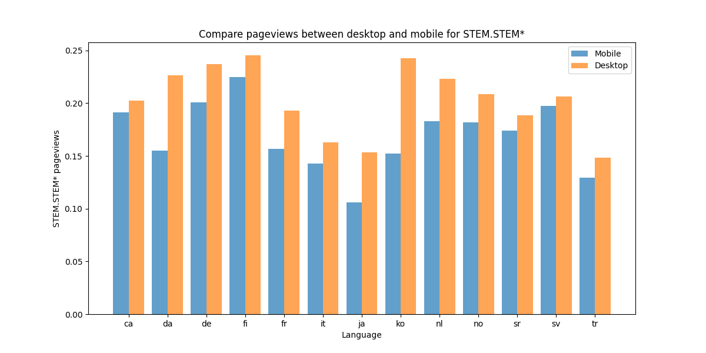
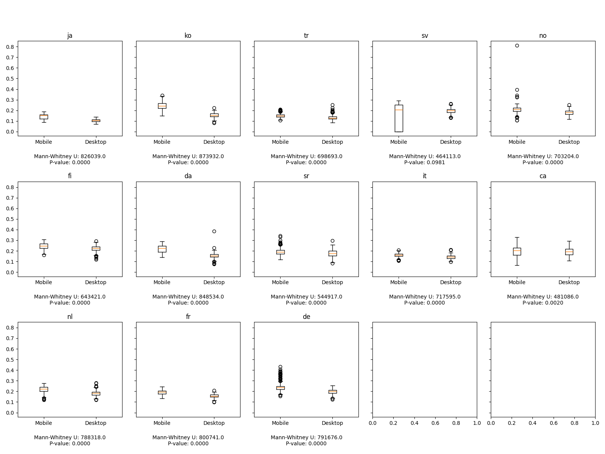
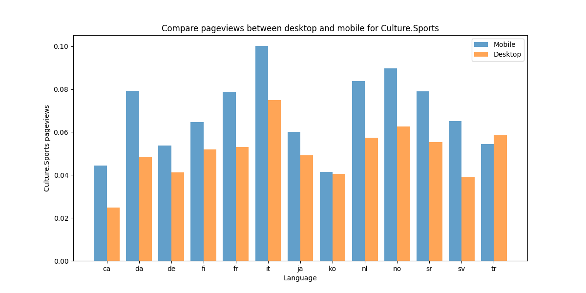
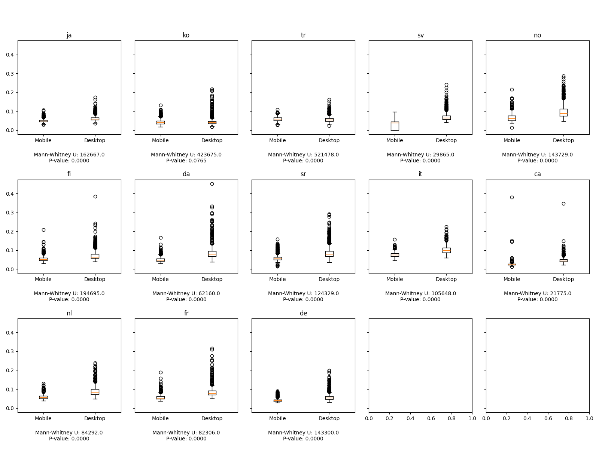
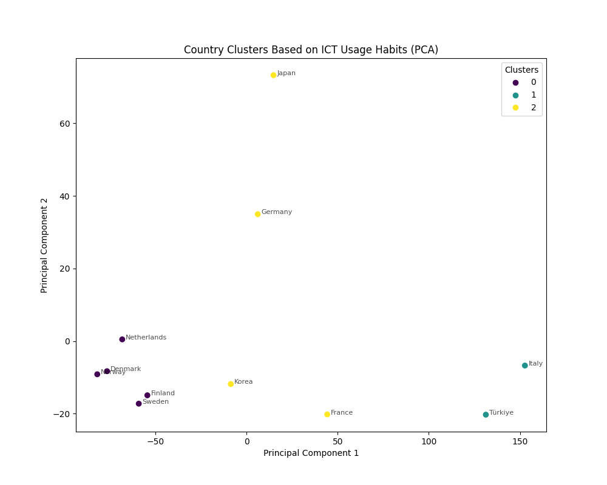
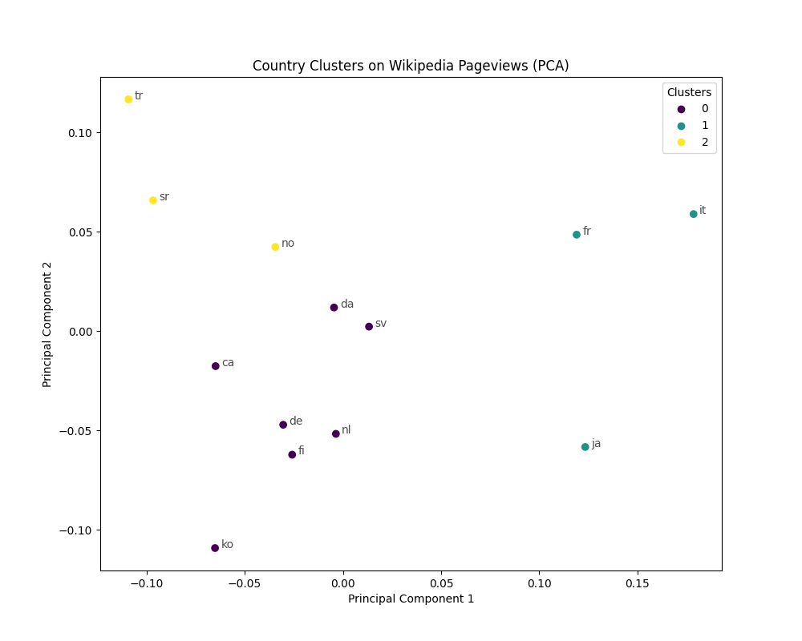
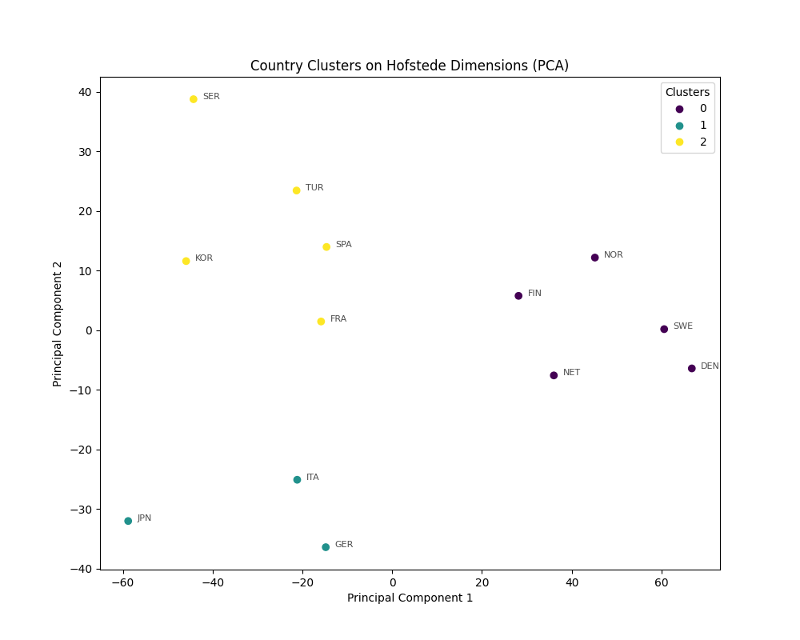

## Introduction

The aim of this step is to investigate the potential correlation between technology use and access habits and cultural interests. In addition, habits of technology use, such as frequency of social media use, online search and digital content consumption, can shape cultural preferences by exposing individuals to specific cultural information, trends and expressions. We began by comparing pageview patterns for different topics according to the medium used by the individual (Desktop or Mobile). We then used machine learning methods to Cluster countries in groups according to their average ICT Access and Usage, Wikipedia pageviews and Hofstede dimensions. We were then able to compare the clusters found.

## Data 

3 different datasets were used: 
- ICT Access and Usage by Households and Individuals dataset
- Hofstede's dimensions dataset 
- Wikipedia Pageviews dataset: The median proportions of pageviews for each topic and language were calculated by considering the individual proportions for that specific topic and language.

## Mobile VS Desktop Analysis

We began by comparing views of articles on various topics, distinguishing between those viewed from a cell phone and those viewed from a desktop computer. This approach enabled us to obtain a preliminary visual assessment of possible variations in article viewing habits depending on the device used.

We have seen that people tend to consult science, internet or engineering-related articles on their desktops. The pageview proportion plots for the topics STEM.STEM* or Culture.Internet culture are good representations of this. One possible explanation for this behavior is that articles in such topics may often involve complex information, detailed graphics, or extensive text and individuals engaging with content in these domains may be more likely to undertake in-depth reading or research, activities that are facilitated by the larger display and enhanced functionality of desktop devices.

In order to establish a true conclusion as to the difference in pageviews of science-related articles between mobile and desktop, it is important to conduct a statistical analysis to assess whether this graphical difference is statistically significant or not. To this end, we plotted boxplots to visualize the distribution of the proportion of pageviews along the time series and conducted a Mann-Whitney U test. We preferred this test to a t-test, as our data do not follow a normal distribution.
As evidenced by the following plots, the p-value of the Mann-Whitney U tests are below 0.05 and we can thus say that the difference in pageview proportions is statistically signficant between mobile and desktop data. 

In contrast, mobile devices are often chosen for quick and convenient information retrieval, and users may prefer them for topics that require shorter engagement or involve more casual browsing. This pattern is suggested by the difference in the pageview proportions for culture-related articles (eg Culture.Food and drink, Culture.Media.Media* or Culture.Sports). This observation is also statistically significant, as evidenced by the boxplots and the result of the Mann-Whitney U tests.

## Clustering Analysis 

To further investigate the correlation between technological access and countries' culture, we performed 3 distinct clustering:
- **Clustering based on ICT access and usage**: A dataset containing statistics about ICT Access and Usage by individuals for each country was used.  It gives a sense of the way citizens use ICT and Internet over all the countries. It contains for example data about the proportion of individuals who did submit forms to public authorities or the proportion of individuals who have transferred files.
- **Clustering based on Wikepedia pageviews**: Clustering was here performed on a dataset containing the global proportions of each topic for each country. Proportions were chosen as the median of the proportion for each day and each topic. 
- **Clustering based on Hofstede's dimensions**: This dataset contains the values of the 6 dimensions defined by Hofstede for each country, that is to say Power Distance Index (PDI), Individualism vs. Collectivism (IDV), Masculinity vs. Femininity (MAS), Uncertainty Avoidance Index (UAI), Long-Term Orientation vs. Short-Term Normative Orientation (LTO), Indulgence vs. Restraint (IVR). 

For the 3 datasets, data was clustered using Agglomerative Clustering and the optimal cluster number was chosen using Silhouette Score. To visualise the clusters, data was plotted in the plan of the 2 Principal Components. In each case, 3 clusters were retrieved and are shown on the following plots:

The following table summarizes the clusters founds:

| Cluster | Countries (ICT)                                              | Countries (Timeseries)                                        | Countries (Hofstede)                                        |
|---------|--------------------------------------------------------|--------------------------------------------------------------|-------------------------------------------------------------|
| 0       | **Denmark**, **Finland**, **Netherlands**, Norway, **Sweden**          | Catalan, **Denmark**, Germany, **Finland**, Korea, **The Netherlands**, **Sweden**  | **Denmark**, **Finland**, **The Netherlands**, Norway, **Sweden**           |
| 1       | Italy, Turkey                                           | France, Italy, Japan                                           | Germany, Italy, Japan                                        |
| 2       | France, Germany, Japan, Korea                           | Norway, Serbia, Turkey                                         | France, Korea, Serbia, Spain, Turkey                        |

- There is some consistency across the three clustering methods, especially with certain countries consistently grouped together (e.g., Denmark, Finland, Netherlands, Sweden in Cluster 0). This suggests that their ICT usage habits, Wikipedia pageview trends and Cultural Identity in the sense of Hofstede dimensions are all similar in a way. 
- Differences exist, indicating that the clusters derived from each dataset might capture different aspects of the countries' characteristics. For many countries the potential correlation between ICT usage and cultural interests is less straightforward and cannot be deduced from this method. 