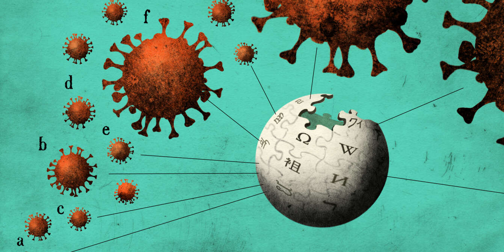

Since the dawn of time, humanity had to face his worst flaw ever: his dying thirst to knowledge. 

Hofstede cultural dimensions model, originally published in the 1970s, is a key tool for understanding cultural differences among countries. 
The 6 dimensions of culture can be defined as follow: 
- **Power Distance** : Power Distance refers to the degree of inequality in the power distribution that a society accepts (a high score means that the society accepts a very hierarchical distribution of power)
- **Individualism VS Collectivism**: It refers to the strength of the interpersonal connections among the group to which people in a society belong (a high score means that this tie is weak)
- **Masculinity Versus Femininity**: It refers to the distribution of roles between men and women in a society. Masculine value are considered as being the ability to behave assertively, to demonstrate your success and to be strong and fast (a high score means men and women tend to have roles that don't overlap)
- **Uncertainty Avoidance Index**: It refers to the degree to which people cope with anxiety (a high score means that people in this society tend to make life as predictable and controllable as possible)
- **Long- Versus Short-Term Orientation**: It refers to the time horizon people in a society display (a high score means that the society tends to be pragmatic, modest and more thrifty whereas a low score means that the society tends to put a bigger emphasis on principles, consistency and truth)
- **Indulgence Versus Restraint**: It refers to the degree to which a society accepts gratification (a high score means that people are encouraged to accept free gratification, like enjoying life and having fun) 

Initially the study was conducted in the 1970s. The validity of these scores could be argued for 2020s thus we use an alternative dataset which updates these scores to 2015.

This project aims at identifying the extent to which Wikipedia pageview trends across countries reflect the cultural values defined by Hofstede. Culture being defined as a set of values firmly anchored within a group of people, we will assume that each country’s culture is stable over a 3-year window.

We have examined this issue from a variety of perspectives and approaches. Each section of this website helps to provide elements of an answer, guiding us towards a deeper understanding of the Wikipedia consultation habits of users from different nations. This is how the structure of this website is organized:
- *General Analysis and Visualizations*: It provides general descriptive plots of the Wikipedia pageviews dataset. 
- *Timeseries Analysis*: It provides a temporal analysis of pageviews related to each topic, by performing time series correlation analysis.
- *Pageviews and Hofstede Dimensions*: It explores cultural shifts during the COVID-19 pandemic by correlating Wikipedia pageview data across different topics with Hofstede’s cultural dimensions scores.
- *Pre/During Covid Analysis*: It compares people's interest before and during Covid, by quantifying the increase or decrease in people's interest in certain topics.
- *Correlation between Cultural Values and Technological Access*: It investigates the browsing habits and interests of people, when they are using their mobile or a desktop. It also tries to identify a potential correlation between Cultural Interests and ICT Access and usage.

  

by RAyanBLAncheSHIvangJUlienPAolo
