## Timeseries analysis

To further analyze the pageviews, we have to dive deeper into the temporality pageviews related to each topic. We will extract the timeseries for each topic and country. 

Then we proceed with:

* Time series correlation for a selected topic between countries
* Averaging of all topics to get a correlation matrix between countries, which we interpret as an adjancy matrix for a weighted graph 
* Use of the Louvain algorithm to cluster the weighted graph.

## Total number of views per language

First let's refresh ourselves with the absolute number of pageviews for each language. We can see that Japan has the most amount of views where as Serbia has the least amount of page views. This is only for curiosity purposes as we will try later to normalize the pageviews so that each country is compared with equal weight.

| language   |   pageviews |
|:-----------|------------:|
| ja         | 66697912133 |
| de         | 58371904626 |
| fr         | 47634003329 |
| it         | 37981254279 |
| nl         |  9260562325 |
| sv         |  5264677265 |
| ko         |  4309682617 |
| fi         |  3771969379 |
| no         |  2172941980 |
| da         |  1811082678 |
| sr         |  1729553733 |

## Total number of views per topic

The same can be done with the total number of views for each topic independantly of the country. Country with a lot of views will be overpresented. The top 5 topics are displayed as taken directly in the dataset. Topics with a `*` at the end, represents "metatopics", we then also pick the top 5 topics for single topics. Geography topics are discarded as well as most often countries look at their own country page which also represent a large amount of pageviews. Geography pages will be reintroduced in the Hofstede correlation analysis later as they give interesting insights.

| topic                            |   pageviews |
|:---------------------------------|------------:|
| Culture.Biography.Biography*     | 25208802842 |
| Culture.Media.Media*             | 21112325261 |
| Geography.Regions.Europe.Europe* | 20598000892 |
| STEM.STEM*                       | 17640541764 |
| Geography.Regions.Asia.Asia*     | 12354924936 |

| topic                   |   pageviews |
|:------------------------|------------:|
| Culture.Sports          |  7002242737 |
| Culture.Literature      |  6794112004 |
| Culture.Biography.Women |  5814688333 |
| Culture.Media.Films     |  5013113401 |
| Culture.Media.Music     |  4941666643 |

## Pageviews over the whole timeperiod

First we have a look at pageviews for a country taking the timeseries for each topic and averaging them. Here again topics with a lot of views will be overpresented but this already gives an idea. 

One important observation is that we see very high spikes on specific dates. Instead of a sudden surge of interest, we hypothesize that is more likely due to automated processes. To overcome this, the easiest solution is to use log scaling. Another possibility that we use is to leverage an outlier detection algorithm available in the python scientific library.

Another already interesting observation is that countries such as Japan see clear a higher influence due to the COVID pandemic where as Denmark has almost the opposite effect where the influence lowers.

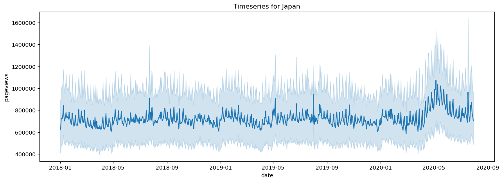
    
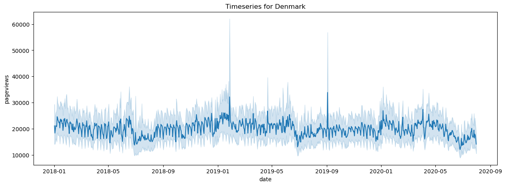
    

## Detect outliers

The outlier detectoin is based on the Isolation Forest algorithm. From the results, we see that it works well in isolating outliers shown in red. Some seemingly good points are also filtered but that is not a large concern for our analysis as it will simply skip these days.

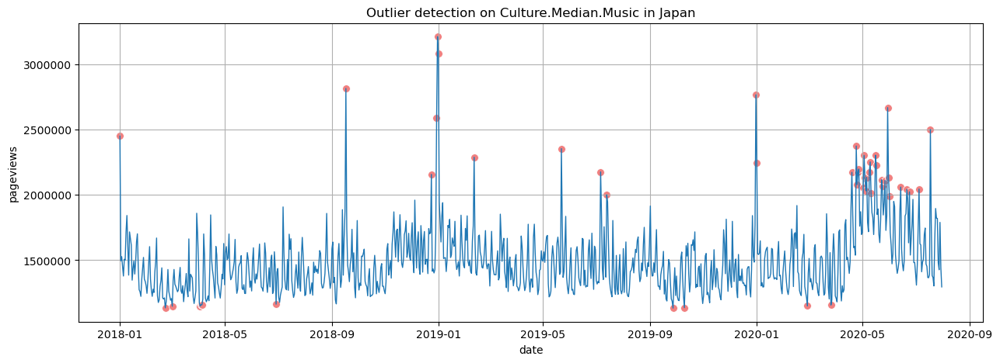
    

## Topics pageviews over the year

Taking into account the outlier detection analysis, we can plot the timeseries for a few selected topics over the year. The timeseries are averaged weekly and the variance is shown with error bars. The timeseries are also standard normalized as we would like to compare between topics and we saw the certain topics receive much more attention so a normalization is required.

    
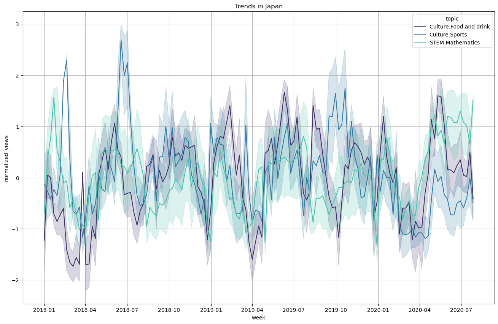
    

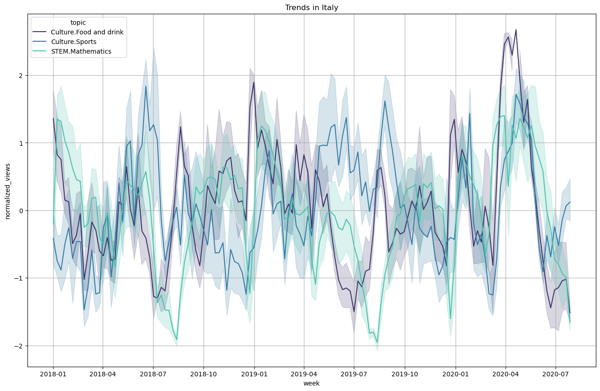
    
    
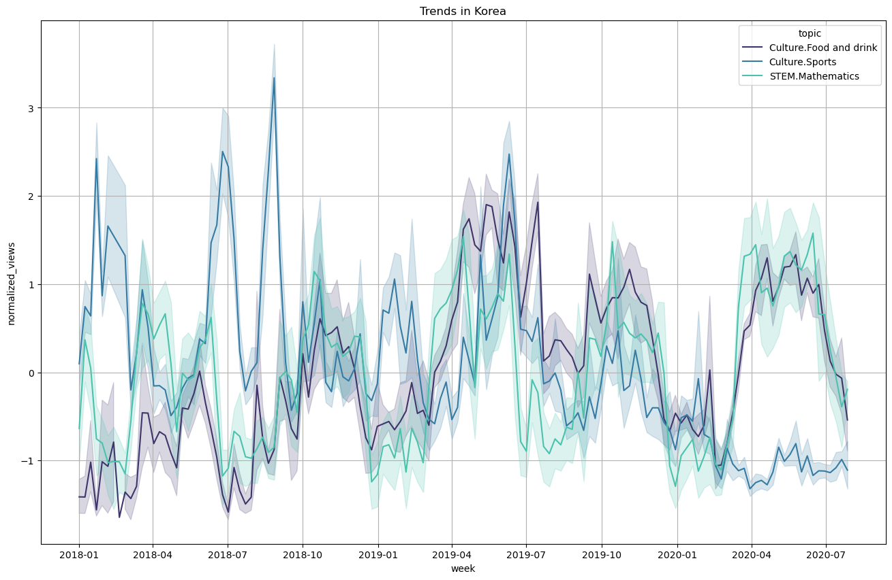
    

## Correlating trends

Armed with all the timeseries for each topics and each country, we can correlates them with each other. First we pick a single topic and correlate the corresponding times series for each country with each other. For example, `Culture.Food and drink` and `Culture.Sports` gives the following correlation matrix for each country. A high correlation score would mean that trends happens at similar times for the countries. Negative score would mean that if one country receives a high interest rate, the other country would decrease the interest for that topic which is not common from the data we see. A value near zero means that trends happens in unrelated time points for the two countries.

    
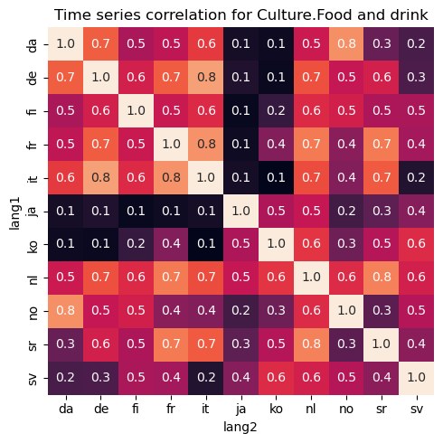
    
    
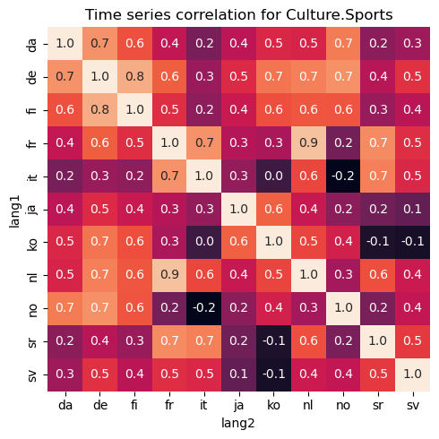
    
    
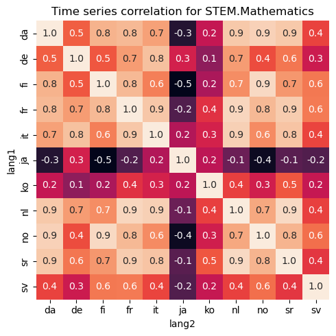
    

## Clustering based on correlation scores

These correlation scores based on trends could be interpred as affinity scores between countries. Based on that, we try to make a graph out of all the countries weighting the edge with the averaged affinity score for all topics. Then by a standard clustering algorithm, we try to see if countries can be clustered based on their page views patterns. 

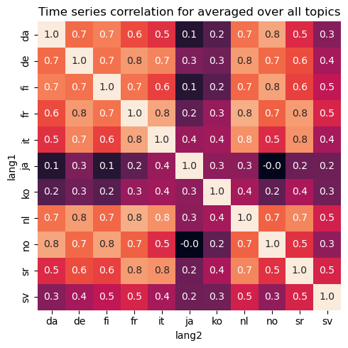
    

With the Louvain algorithm and a resolution of 0.9 we get plausible clusters that reflect the intuitive clustering of countries. Sweden is its own cluster but this may be due to the partial mobile data gathered in that country. We thus omit it in the final results.

1. `no`, `da`, `fi`, `nl`, `de` : "Germanic countries"

2. `it`, `sr`, `fr` : "Latin and Slavic countries"

3. `ko`, `ja` : "Far Eastern countries"

The affinity is shown in blue for each edges. A stronger blue represents stronger affinity.
    
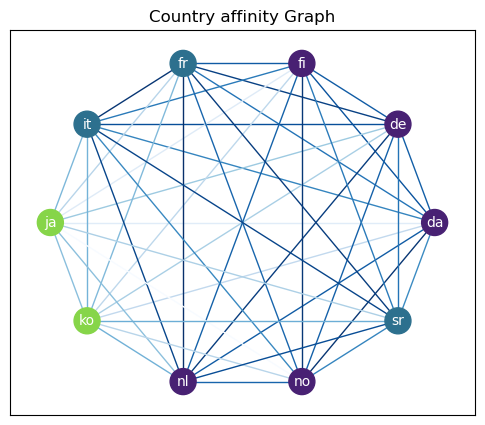

In the Pre/During Covid Analysis section, we will further try to cluster countries but also taking into account the Hofstede dimensions.

