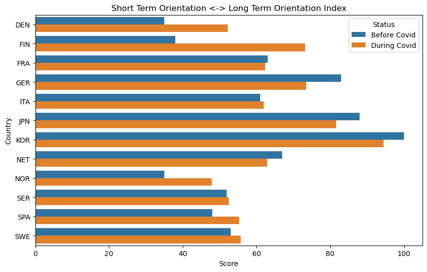

## Introduction
This step aimed to explore cultural shifts during the COVID-19 pandemic by analyzing Wikipedia pageview data across different topics and correlating them with Hofstede's cultural dimensions scores for various countries. The analysis was divided into several phases to understand changes in interests and potential cultural shifts pre and during the pandemic.

## Methodology
### Data Collection and Preprocessing

- Retrieved Wikipedia pageview data for multiple topics across countries.
- Segmented data into pre-COVID and during-COVID periods.
- Calculated proportions of pageviews for each topic, representing countries' 'interest' in specific subjects.

### Statistical Analysis
- Conducted t-tests to compare pre-COVID and during-COVID proportions for each topic, identifying significant shifts in interests over time.

### Correlation Analysis
- Calculated correlations between median pre-COVID pageview proportions and Hofstede's cultural dimensions scores across topics.
- Identified relationships between specific topics and cultural dimensions.

### Machine Learning Approach
- Utilized a random forest regression model.
- Trained the model with pre-COVID median proportions data.
- Predicted Hofstede's cultural dimensions scores from during-COVID median proportions, hypothesizing cultural changes during the pandemic.

# Results
### T-test Analysis
- Most topics exhibited significant changes in interest levels between pre-COVID and during-COVID periods, as determined by t-tests.

Out of the 492 different combinations of language and topic, there were only about 100 which had a p-value of greater than 0.05, indicating that in general there is a statistically significant difference between the pageviews pre-covid and during-covid.

### Correlation Analysis Between Topics and Cultural Dimensions
- Strong correlations were found between specific topics and certain cultural dimensions, providing insights into how wikipedia pageviews can reveal information about culture.
<label for="map_select"></label>
<select id="correlation_selection">
    <option value = "map_idv_corr">Individualism vs Collectivism</option>
    <option value = "map_ivr_corr">Indulgence vs Restraint</option>
    <option value = "map_ltowvs_corr">Long Term vs Short Term Orientation</option>
    <option value = "map_mas_corr">Masculinity vs Femininity</option>
    <option value = "map_pdi_corr">Power Distance Index</option>
    <option value = "map_uai_corr">Uncertainty Avoidance Index</option>
</select>

#### 'Individualism vs Collectivism' and Topic Correlations:
- **'Culture.Media.Music' and 'Culture.Media.Entertainment'**: High correlation indicates that societies with a greater interest in music and entertainment may lean towards individualism, emphasizing personal expression and interests.
- **'STEM.Computing' and 'STEM.Mathematics'**: The negative correlation suggests that interest in computing and mathematics aligns with collectivist societies, possibly indicating collaborative problem-solving and shared intellectual pursuits.

### 'Indulgence vs Restraint' and Topic Correlations:
- **'Culture.Food and Drink'**: A high correlation implies that societies with a strong interest in diverse culinary experiences might exhibit more indulgent cultural traits.
- **'STEM.Computing'**: The negative correlation could suggest a restrained approach to logical thinking and problem-solving, aligning with more collectivist values.

### 'Long Term vs Short Term Orientation' and Topic Correlations:
- **'STEM.Computing' and 'Culture.Internet Culture'**: Societies valuing long-term orientation may show interest in innovative technologies (like computing) and adaptable online cultures.
- **'Culture.Philosophy and Religion' and 'History and Society.Politics and Government'**: The negative correlation suggests that these areas emphasizing tradition and immediate concerns align more with short-term orientation.

### 'Masculinity vs Femininity' and Topic Correlations:
- **'Culture.Visual Arts'**: High correlation suggests that aspects of visual arts might align with masculine traits, such as assertiveness or bold expression.
- **'Culture.Media.Radio' and 'STEM.Biology'**: hese topics may emphasize nurturing, collaboration, and emotional expression, characteristics associated with feminine values, showing a negative correlation.

### 'Power Distance Index' and Topic Correlations:
- **'History and Society.History'**: The positive correlation indicates that societies valuing historical narratives might align with higher power distance, emphasizing authority and hierarchical structures.
- **'Culture.Food and Drink' and 'Culture.Media.Music'**: Negative correlation implies that these areas might promote inclusive and egalitarian experiences, contrasting with higher power distance societies.

### 'Uncertainty Avoidance Index' and Topic Correlations:
- **'STEM.Computing'**: The positive correlation suggests that computing aligns with societies aiming to avoid uncertainty, possibly due to structured problem-solving approaches.
- **'Culture.Media.Radio' and 'Culture.Food and Drink'**: Negative correlations imply that these areas might embody spontaneity and flexibility, contrasting with societies aiming to minimize uncertainty.

### Machine Learning Predictions
- The Random Forest regression model predicted potential changes in Hofstede's cultural dimensions scores during the COVID-19 period based on shifts in interests indicated by Wikipedia pageviews.

<label for="map_select"></label>
<select id="covid_selection">
    <option value="map_idv_covid">Individualism vs Collectivism</option>
    <option value="map_ivr_covid">Indulgence vs Restraint</option>
    <option value="map_ltowvs_covid">Long Term vs Short Term Orientation</option>
    <option value="map_mas_covid">Masculinity vs Femininity</option>
    <option value="map_pdi_covid">Power Distance Index</option>
    <option value="map_uai_covid">Uncertainty Avoidance Index</option>
</select>

    

    

    

    

    

    

## Limitations and Future Directions
- Naturally, the reliance on Wikipedia pageview data presents many limitations in representing comprehensive cultural interests. Culture is a much more nuanced concept that cannot entirely be quantified or encapsulated by Wikipedia pageviews. 
- Future research could incorporate additional datasets or longitudinal studies to validate and deepen the understanding of cultural shifts during global crises.

