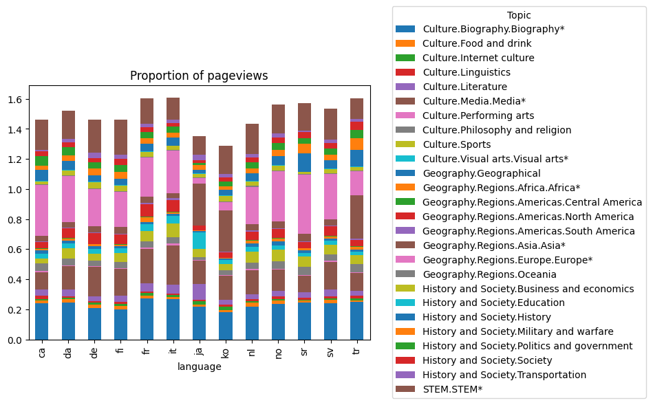
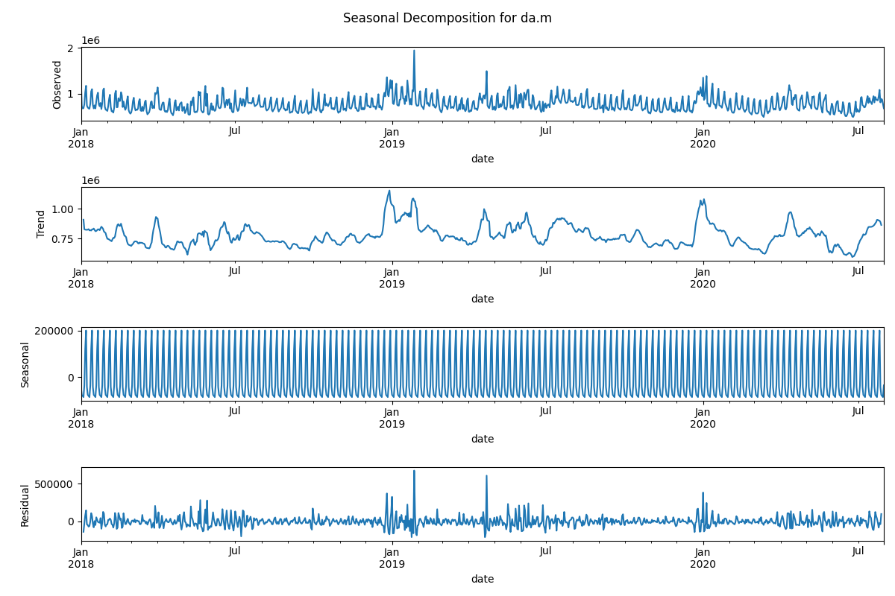

Before diving into the analysis of th cultural interests, it would be interesting to get a more global overview of our data. 

# Proportion of pageviews by language

First of all, let's visualize the proportion of each subject for each language, using a stacked bar plot.

It's important to highlight that the total proportion of all page views does not necessarily add up to 1, which might seem counterintuitive; however, this discrepancy arises from the fact that certain articles are categorized under multiple topics.

  

As they are many topics, this plot is hardly readable. We thus mapped the sub-topics into more general topics : 
- STEM (Science, Technology, Engineering, and Mathematics)
- History & Society
- Geography
- Culture

 The proportion of pageviews for topics related to Culture or Geography is way more important than the proportion of pageviews for topics related to History & Society or Culture. This is overally true for all the languages studied. So we'll need to highlight the differences in sub-topics pageview trends between countries using other methods.

 # Seasonal Decomposition of pageview time series

In our exploration of pageview patterns, we applied seasonal decomposition to the global time series for each country, revealing essential components like trend, seasonality, and residual factors. Notably, the periodic patterns observed in the seasonal component plots underline weekly trends in Wikipedia pageviews for both mobile and desktop data, while the stable trend components indicate a consistent long-term behavior in pageview accesses, providing valuable insights into user engagement dynamics.

Here are the seasonal decompositions for Denmark and Korea for both Mobile and Desktop Data:

Here are their respective periodograms, also for both Mobile and Desktop data. Periodograms allow a finer analysis of the seasonality patterns. The weekly trends described above are best illustrated by the peak at fs/52 = 7 on the periodograms. This is the most dominant frequency (and therefore seasonality), as it has the greatest amplitude. This peak is visible for all countries, for both mobile and desktop page views.

