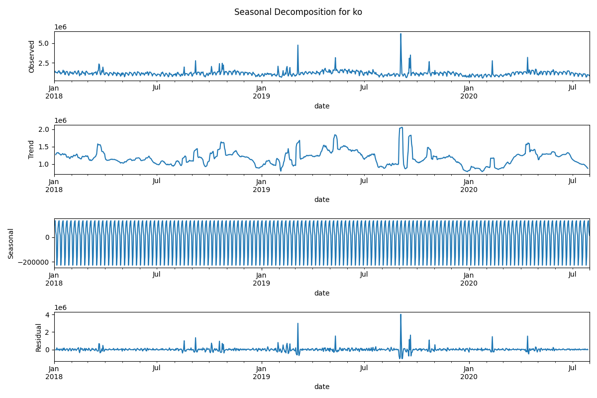

Before diving into the analysis of th cultural interests, it would be interesting to get a more global overview of our data. 

# Proportion of page views by language

First of all, let's visualize the proportion of each subject for each language, using a stacked bar plot:

  

As they are many topics, this plot is hardly readable. We thus mapped the sub-topics into more general topics : 
- STEM (Science, Technology, Engineering, and Mathematics)
- History & Society
- Geography
- Culture

  

 The proportion of pageviews for topics related to Culture or Geography is way more important than the proportion of pageviews for topics related to History & Society or Culture. This is overally true for all the languages studied. So we'll need to highlight the differences in sub-topics pageview trends between countries using other methods.

When decomposing seasonally pageview patterns all topics combined, what strikes the most is that there are some weekly patterns in Wikipedia peageviews, for both mobile and desktop data:

<html>
Plese select a country to display the details :
<label for="seasonality_select_country"></label>
<select id="seasonality_selection_country" name="seasonality_country">
    <option value = "select country" selected="selected_country"> ---Select--- </option>
    <option value = "Catalonia (Desktop)">Catalonia_Desktop</option>
    <option value = "Catalonia (Mobile)">Catalonia_Mobile</option>
    <option value = "Denmark (Desktop)">Denmark_Desktop</option>
    <option value = "Denmark (Mobile)">Denmark_Mobile</option>
    <option value = "Finland (Desktop)">Finland_Desktop</option>
    <option value = "Finland (Mobile)">Finland_Mobile</option>
    <option value = "France (Desktop)">France_Desktop</option>
    <option value = "France (Mobile)">France_Mobile</option>
    <option value = "Germany (Desktop)">Germany_Desktop</option>
    <option value = "Germany (Mobile)">Germany_Mobile</option>
    <option value = "Italy (Desktop)">Italy_Desktop</option>
    <option value = "Italy (Mobile)">Italy_Mobile</option>
    <option value = "Japan (Desktop)">Japan_Desktop</option>
    <option value = "Japan (Mobile)">Japan_Mobile</option>
    <option value = "Korea (Desktop)">Korea_Desktop</option>
    <option value = "Korea (Mobile)">Korea_Mobile</option>
    <option value = "Norway (Desktop)">Norway_Desktop</option>
    <option value = "Norway (Mobile)">Norway_Mobile</option>
    <option value = "Netherlands (Desktop)">Netherlands_Desktop</option>
    <option value = "Netherlands (Mobile)">Netherlands_Mobile</option>
    <option value = "Sweden (Desktop)">Sweden_Desktop</option>
    <option value = "Sweden (Mobile)">Sweden_Mobile</option>
    <option value = "Turkey (Desktop)">Turkey_Desktop</option>
    <option value = "Turkey (Mobile)">Turkey_Mobile</option>
</select>

<section id = "show_Catalonia_d" style="display: none;">

<h3><b>Catalonia Desktop</b></h3>
 
 

</section>

<section id = "show_Catalonia_m" style="display: none;">

<h3><b>Catalonia Mobile</b></h3>
 
 

</section>

<section id = "show_Denmark_d" style="display: none;">

<h3><b>Denmark Desktop</b></h3>
 
 

</section>

<section id = "show_Denmark_m" style="display: none;">

<h3><b>Denmark Mobile</b></h3>
 
 

</section>

<section id = "show_Finland_d" style="display: none;">

<h3><b>Finland Desktop</b></h3>
 
 

</section>

<section id = "show_Finland_m" style="display: none;">

<h3><b>Finland Mobile</b></h3>
 
 

</section>

<section id = "show_France_d" style="display: none;">

<h3><b>France Desktop</b></h3>
 
 

</section>

<section id = "show_France_m" style="display: none;">

<h3><b>France Mobile</b></h3>
 
 

</section>

<!-- Sections for Germany -->
<section id="show_Germany_d" class="country-section">
    <h3><b>Germany Desktop</b></h3>
    

        
    

</section>

<section id="show_Germany_m" class="country-section">
    <h3><b>Germany Mobile</b></h3>
    

        
    

</section>

<!-- Sections for Italy -->
<section id="show_Italy_d" class="country-section">
    <h3><b>Italy Desktop</b></h3>
    

        
    

</section>

<section id="show_Italy_m" class="country-section">
    <h3><b>Italy Mobile</b></h3>
    

        
    

</section>

<!-- Sections for Japan -->
<section id="show_Japan_d" class="country-section">
    <h3><b>Japan Desktop</b></h3>
    

        
    

</section>

<section id="show_Japan_m" class="country-section">
    <h3><b>Japan Mobile</b></h3>
    

        
    

</section>

<!-- Sections for Korea -->
<section id="show_Korea_d" class="country-section">
    <h3><b>Korea Desktop</b></h3>
    

        
    

</section>

<section id="show_Korea_m" class="country-section">
    <h3><b>Korea Mobile</b></h3>
    

        
    

</section>

<!-- Sections for Norway -->
<section id="show_Norway_d" class="country-section">
    <h3><b>Norway Desktop</b></h3>
    

        
    

</section>

<section id="show_Norway_m" class="country-section">
    <h3><b>Norway Mobile</b></h3>
    

        
    

</section>

<!-- Sections for Netherlands -->
<section id="show_Netherlands_d" class="country-section">
    <h3><b>Netherlands Desktop</b></h3>
    

        
    

</section>

<section id="show_Netherlands_m" class="country-section">
    <h3><b>Netherlands Mobile</b></h3>
    

        
    

</section>

<!-- Sections for Sweden -->
<section id="show_Sweden_d" class="country-section">
    <h3><b>Sweden_Desktop</b></h3>
    

        
    

</section>

<section id="show_Sweden_m" class="country-section">
    <h3><b>Sweden_Mobile</b></h3>
    

        
    

</section>

<!-- Sections for Turkey -->
<section id="show_Turkey_d" class="country-section">
    <h3><b>Turkey_Desktop</b></h3>
    

        
    

</section>

<section id="show_Turkey_m" class="country-section">
    <h3><b>Turkey_Mobile</b></h3>
    

        
    

</section>

 
 

</html>

