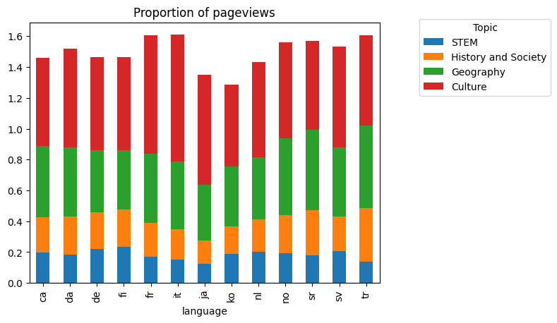

    

I want to see specific details for <label for="map_selection"></label>
<select id="map_selection" name="registration">
    <option value="select_region" selected="selected">---Select---</option>
    <option value="map1">option1</option>
    <option value="map2">option2/option>
</select>

    

    

 

